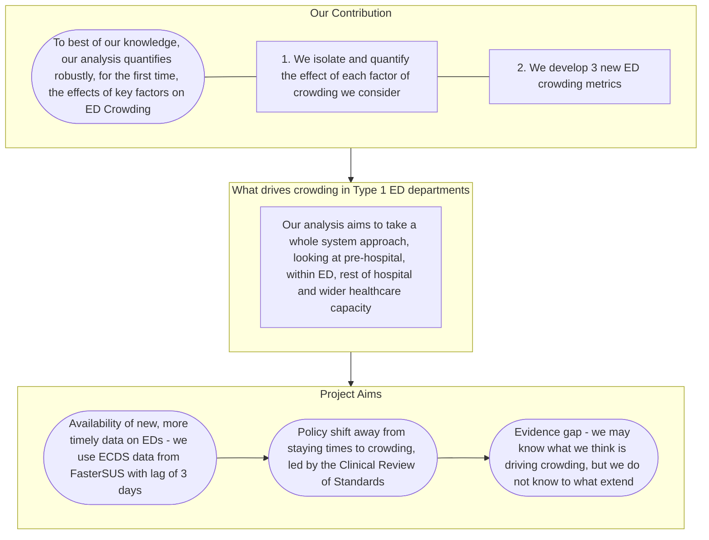
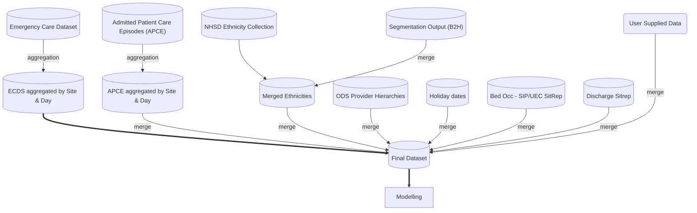
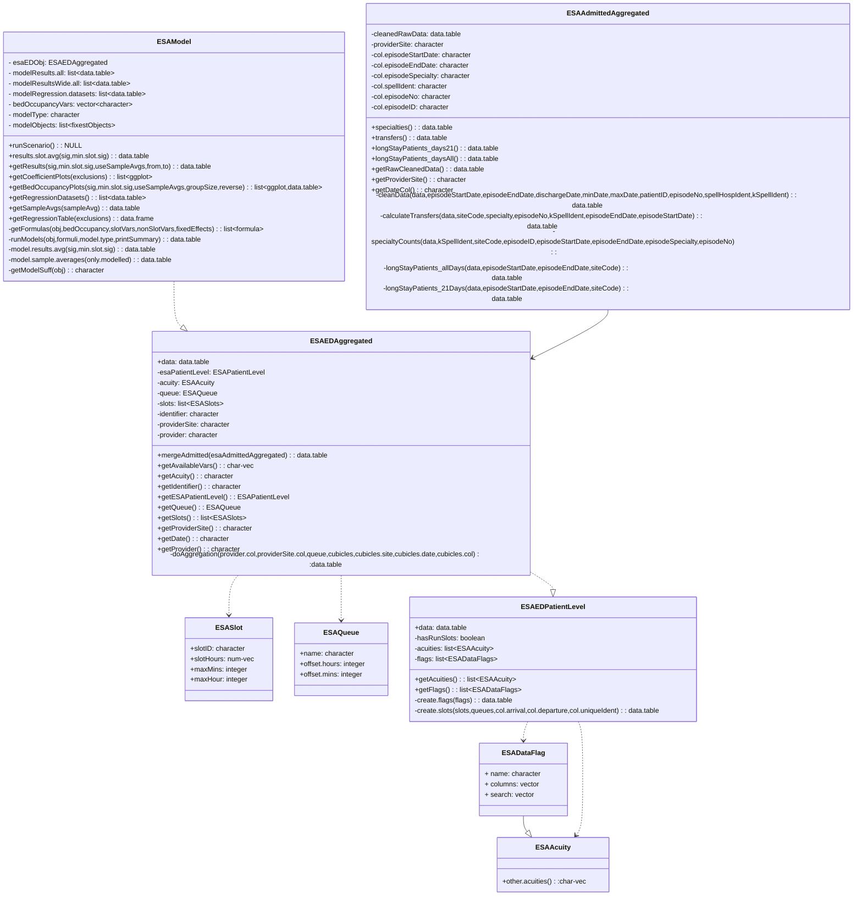

<a name="readme-top"></a>

<!-- project shields -->

[![Issues][issues-shield]][license-url]
[![Forks][forks-shield]][forks-url]
[![Stars][stars-shield]][stars-url]
[![MIT License][license-shield]][license-url]

<!-- project header -->
<br/>
<div align="center">
	<h3 align="center">NHS Emergency Department Crowding Model</h3>
	<p align="center">
		The Economics and Strategic Analysis Team, working under the Chief Data and Analytics Officer (CDAO) at NHS England have developed a model to investigate Emergency Department (ED) crowding. This builds on previous analysis conducted within the team. This model aims to take a whole system approach, looking at drivers of crowding pre-hospital, within A&E, rest of hospital and wider healthcare capacity.
		<br/>
		<a href="https://github.com/nhsengland/ESA_ED_Crowding/issues">Report Bug</a>
		<a href="https://github.com/nhsengland/ESA_ED_Crowding/issues">Request Feature</a>
	</p>
</div>

<!-- table of contents -->
<details>
	<summary>Table of Contents</summary>
	<ol>
		<li><a href="#aims">Aims</a></li>
		<li><a href="#motivation-contribution">Motivation & Contribution</a></li>
		<li><a href="#what-is-ed-crowding">What is ED crowding, and why is it important?</a></li>
		<li><a href="#how-we-measure-crowding">How do we measure ED crowding?</a></li>
		<li><a href="#our-model">Our model</a></li>
		<li><a href="#packages">Packages</a></li>
		<li><a href="#usage">Usage</a></li>
		<li><a href="#data-sources">Data Sources</a></li>
		<li><a href="#data-flows">Data flows</a></li>
		<li><a href="#installation">Installing the package</a></li>
		<li>
			<a href="#getting-started">Getting Started</a>
			<ul>
				<li><a href="#class-overview">Class overview</a></li>
				<li><a href="#slots">Slots</a></li>
				<li><a href="#queues">Queues</a></li>
				<li><a href="#ed-attendance-vars">ED attendance variables</a></li>
				<li><a href="#acuity">Acuity</a></li>
				<li><a href="#ed-patient-level">ED patient level</a></li>
				<li><a href="#ed-aggregated">ED aggregated</a></li>
				<li><a href="#esa-ed-crowding-model">ESA ED Crowding Model</a></li>
				<li><a href="#inpatients-data">Inpatients data</a></li>
			</ul>
		</li>
		<li><a href="#note-on-add-vars">A note on additional variables</a></li>
		<li>
			<a href="#additional-considerations">Additional Considerations</a>
			<ul>
				<li><a href="#share-variables">Share Variables</a></li>
				<li><a href="#subgroups">Subgroups</a></li>
				<li><a href="#policy-environment">Policy environment</a></li>
			</ul>
		</li>
		<li><a href="#contributing">Contributing</a></li>
		<li><a href="#license">License</a></li>
		<li><a href="#contact">Contact</a></li>
	</ol>
</details>

__Note:__ _No data is shared in this repository._

## Aims

The purpose of the code is for other users within the NHS system, to take this work forward. We therefore have developed using the R programming language. The main interface for this analysis is designed to be as simple as possible, and has been developed in a database-agnostic manner. The package is built in a manner to allow user customizability, for example, one may wish to explore the effect of factors on ED crowding over the whole day, rather than for specific slots.

<p align="right">(<a href="#readme-top">back to top</a>)</p>

## Motivation & Contribution



## What is ED crowding, and why is it important?

Crowding occurs in ED when patients are stuck in a queue. Previous research shows that crowding:

- is associated with increased patient mortality
- reduces the quality of care
- compromises patient privacy and dignity
- compromises the ability to deliver basic nursing care

During winter 2019/20 (pre-COVID-19), pressure on acute hospital bed base resulted in unacceptable crowding in EDs, and, in some cases, patients being cared for in inappropriate environments (_corridor care_).

COVID-19 has made ED crowding worse, requiring longer, deeper cleans, and social distancing

Crowding can occur for three types of ED patients

- **Majors** - patients with most complicated injuries or illnesses e.g. shortness of breath or hip injuries
- **Minors** - least seriously injured or ill patients, with injuries such as ankle or wrist injuries
- **Resus** - crowding expected to be less of a problem in **resus** as these are the most seriously injured or ill patients

<p align="right">(<a href="#readme-top">back to top</a>)</p>

## How do we measure ED crowding?

After engaging with stakeholders, we decided to model ED crowding using three metrics. The first two metrics are seperately calculated for each type of patient (**majors**/**minors**/**resus**) and for each time slot in the day. The third metric is only estimated for **majors** and **resus**.

**Overall Crowding**: ***Number of patients staying at ED***. This metric counts the number of patients who are present at each time slot irrespective of whether they were discharged in a later slot, or arrived in an earlier one. For example, it will count the number of majors patients at an ED site, on a given day (for a given time slot) as long as they were present in that time slot/day/site, and irrespective of their staying time and arrival/discharge times.

**6 hours + stays**: ***Number of patients staying longer than 6 hours at ED***. This is a subset of the overall crowding metric. It counts the number of patients who would have been staying for 6+ hours by the end of the slot, or their discharge time, whichever is earlier.

**Cubicle crowding**: ***Number of majors and resus patients staying in the ED per cubicle***. We sum the overall crowding metric for majors and resus patients (for a given site/day/time slot) and divide by the number of majors + resus cubicles for that site.

<p align="right">(<a href="#readme-top">back to top</a>)</p>

## Our model

Econometric analysis enables us to isolate the impact of the different factors on crowding in ED's. **This allows us to show the effect of each individual variable once we keep the values of the other variables fixed**

We create separate models to look at three crowding metrics for three patient types (**majors**, **minors**, **resus**). We divide the day into six 4-hour slots. We estimate the effect of the various factors below on '_overall crowding_' and '_6hr+ stays_' for each slot and type of patient. We also look at the effect of the various factors on '_cubicle crowding_' for majors+resus patients (and each of the 6 time slots).

| Pre-hospital | Controls & Time effects | Within ED | Rest of Hospital Capacity | Wider Healthcare Capacity |
| :---- | :--- | :--- | :--- | :--- |
| Arrival mode | Patients over 75 (frailty proxy) | Complaint (MAU) | G&A bed occupancy | Fit for discharge patients not discharged |
| Referral source | Ethnicity | Investigation | ACC bed occupancy | |
| | Deprivation | Diagnosis | Number of long-stay patients (>=21d) | |
| | Sex | | Admitted patient transfers between site/specialty/both | |
| | Day of week | | Number inpatients in each specialty | |
| | Bank Holiday | | Share of admitted patients from ED | |
| | Month | | | |

**There may be unobserved variation between sites, and while we cannot directly measure the effect of those factors on crowding, as long as they do not vary much over time, our modelling approach minimises the danger that our results are affected by their non-inclusion.**

<p align="right">(<a href="#readme-top">back to top</a>)</p>

## Packages

| Package Name  | Purpose                                   |
| ------------- |:----------------------------------------: |
| data.table    | alternative to R's default data.frame     |
| R6            | enable object-orientated programming      |
| odbc          | interface to ODBC drivers                 |
| fixest        | estimate fixed effects econometric models |
| ggplot2       | used for some plots                       |
| gt (suggested)| create HTML tables from regression tables |

<p align="right">(<a href="#readme-top">back to top</a>)</p>

## Usage

We rely on hospital activity data from the Secondary Uses Service repository. However, the user is free to rely on their own data-sources, provided the relevant data points are present. We implement R6 classes to clean, prepare, derive and aggregate data for both (admitted) inpatients, and emergency department attendances. Whilst some level of data cleaning is present, when using data other than SUS, it is recommended that data be adequately prepared beforehand. Furthermore, it is easy to supplement the aforementioned datasets with other relevant data, we do so utilising NHS England Situation Reports (SitReps).

<p align="right">(<a href="#readme-top">back to top</a>)</p>

## Data Sources

| Name | Location | Purpose | Notes | Columns Required |
| :--: | :----- | :--- | :--- | :--- |
| Admitted Patient Care Episodes (APCE) | fasterSUS, NCDR | Allow derivation of variables relating to inpatients e.g. transfers between site/specialty/both, number of inpatients within specialties, and long-stay patients | As only episodes which have reached their conclusion (e.g. no un-finished episodes) are present, sufficient time should be allowed for episodes to adequately conclude (e.g. latest date analysed could be 30 days previous to today for example). There should also be a buffer preceeding the time period of analysis, to capture patients who already have been admitted (if selecting episodes by the episode start date; we use 21 days preceeding). Note that we in our modelling, we lag specialty counts by 1 day (e.g. specialty count in the previous day) to avoid issues of reverse-causality | APC_Ident, Episode_Start_Date, Episode_End_Date, Discharge_Date, Episode_Number, Der_Pseudo_NHS_Number, Main_Speciality_Code, Provider_Code, Der_Provider_Site_Code, Hospital_Spell_No |
| Emergency Care Dataset (ECDS) | fasterSUS, NCDR | Primary dataset containing all ED attendances | We require the 24 SNOMED_CT Investigation codes via the EC_Investigation table, and the 24 SNOMED_CT Diagnosis codes via the EC_Diagnosis table | all |
| NHSD Ethnicity + Segmentation  | COVID-19 PSDM | Provides better ethnicity data coverage. | Note that this table is in some ways optional, as ECDS does contain an ethnicity field. We merge the NHSD ethnicity collection with Segmentation (with the former prioritized over the latter) | Derived, 2001 ethnic category code |
| ODS Provider Hierarchies | NHSE Reference tables, NCDR | Map NHS Providers to their NHSE Regions | | Organisation_Code, Region_Name |
| Holiday days (Other Dates) | NHSE Reference tables, NCDR | Determine whether a given day is a holiday | | Date, derived field based on Holiday_Desc |
| Discharge Sitrep | Discharge Daily Sitrep, COVID-19 PSDM| Derive the discharge rate (the proportion of those who were fit to be discharged, who were discharged) | Indicator of wider-system pressures e.g. social care | Period_DateTime_Start, Org_Code, Metric_ID, Metric_Value |
| Bed Occupancy | Strategic Insights Platform (SIP) | Derive Adult Critical Care (ACC) and General & Acute (G&A) bed occupancy <br/> ($\frac{\text{occupied beds}}{\text{open beds}}$) | These figures can be alternatively obtained via the Acute SitRep in the COVID-19 PSDM. We bucket each type of bed occupancy into 0-80%, then one percentage point increments until 100% bed occupancy. Modeling on regions (or smaller) may require larger bucket sizes (e.g. five percentage point buckets) due to the small amount of trusts relative to the number of levels. Note again that in our modeling, we use the previous day's bed occupancy levels rather than that of the present day. This is to mitigate any potential reverse-causality. | G&ATotalBedsOpen, G&ATotalBedsOccupied, ACCBedsOpen, ACCBedsOccupied, OrgCode, Period, Site_Code |
| Cubicles | Internally via Get It Right First Time (GIRFT) | Number of (majors and resus) cubicles | Note this datasource is static (e.g. no variation over time) | |

<p align="right">(<a href="#readme-top">back to top</a>)</p>

## Data flows

Below is a summary of the data flows for those data sources used. Note the `User Supplied Data` box, this represents any additional data the user wishes to utilize within their modeling. These are required to be at Provider/Provider Site and day level.



<p align="right">(<a href="#readme-top">back to top</a>)</p>

## Installing the package

Our package can be installed directly from github using the **devtools** package.

```r
devtools::install_github('NHSEngland/ESA_ED_Crowding')
```

and can be loaded as with any other R package, `library(ESAedcrowding)`

## Getting Started

### Class overview



### Slots

We split the day into 6 four hour slots - these are represented through `ESASlot` objects.

```r
slots <- list(slot1=ESASlot$new(slotID='slot_1',
								slotHours=0:3),
              slot2=ESASlot$new(slotID='slot_2',
			  					slotHours=4:7),...)
```

Users are free to customise this; whether you want to run the model considering a day in its entirety, or some other breakdown.

 ```r
 slots <- list(slot1=ESASlot$new(slotID='slot_1',
                                 slotHours=0:23)
 ```

### Queues

We can specify queue objects (`ESAQueue`), which allow running models looking at patients who have stayed in the ED for a minimum amount of time - we look at 6 hour + stays. However, users may wish to investigate what factors affects those waiting over 12 hours, in alignment with the Clinical Review of Standards. This can be achieved by setting the `offset.hours` argument to `12`.

```r
queues <- list(longQueue=ESAQueue$new(name='long',
                                      offset.hours=6))
```

### ED attendance variables

Our model is daily site-level panel model, we therefore define flags for our desired variables, and aggregate up and calculate ***the share*** of ED attendances having that characteristic. We can specify `ESADataFlag` objects which allow defining the column(s) and search value(s) for each variable.

```r
flags <- list(
  ESADataFlag$new(name='trauma_comp',
                  columns='EC_Chief_Complaint_SNOMED_CT',
                  search=c('282765009','282766005',...),
                  ...)
```

It is worth noting ahead of time, that these variables derived via ECDS have a unique interpretation, compared with other variables within the model. Specifically, these variables are all defined as ***relative to an omitted baseline***. They also require that, for a given column, at least one level is omitted, otherwise one will encounter perfect multi-collinearity. For example, taking ethnicity, one may include 'Mixed', 'Black', 'South Asian', 'Chinese', 'Other' and 'Unknown' in the model, thus leaving 'White' as the omitted level. The intepretation would therefore be: a one unit (e.g. percentage point) increase in the share/proportion of ED patients of Mixed ethnicity, _relative to 'White' ethnicity_ is associated with... effect on crowding.

With clinican input, we include a new variable which _proxies_ for the Medical Assessment Unit (MAU). This is based on various Chief Complaint SNOMED CT codes available within ECDS, using the `EC_Chief_Complaint_SNOMED_CT` field. Note that this is a proxy, as we cannot directly determine those patients who are routed through the MAU.

We use the following SNOMED CT codes to proxy for the MAU, split by ECDS group for ease of viewing.

| ECDS group | SNOMED CT codes to proxy for MAU |
| :---: | :--- |
| Airway / breathing | 267036007, 230145002, 70407001, 66857006, 262599003, 87317003 |
| Circulation / chest | 29857009, 80313002, 427461000, 271594007, 762898005, 162784002, 21631000119105, 410429000, 422970001 |
| Gastrointestinal | 21522001, 14760008, 62315008, 422587007, 422400008, 60728008, 65958008, 18165001, 79890006, 8765009, 77880009, 249624003, 276464002, 47609003, 40739000, 33334006, 70176004 |
| Neurological | 25064002, 40917007, 3006004, 91175000, 404640003, 44077006, 26079004, 394616008, 193462001 |
| Trauma / musculoskeletal | 282765009, 282766005, 161891005 |
| Genitourinary | 49650001, 28442001, 267064002, 83128009, 34436003, 247355005, 20502007, 281398003, 25565007, 6923002, 300528000, 56890008 |
| Environmental | 75478009, 371708003, 386689009, 370977006, 87970004, 417981005, 371704001, 57335002 |
| General | 386661006, 80394007, 302866003, 225358003, 385486001, 13791008, 398979000, 161152002, 78680009, 182888003, 84387000 |

In addition to the MAU variable above, we derive the following variables via ECDS. Note NA refers to searching for a missing value.

| Description | Column | Search Terms |
| :--- | :--- | :--- |
| Whether patient was refered from primary care | EC_Attendance_Source_SNOMED_CT | 276491000, 166941000000106, 879591000000102 |
| Whether patient self-attended ED | EC_Attendance_Source_SNOMED_CT | 1065391000000104, 07291000000100, 315261000000101 |
| Whether patient arrived making their own way to the ED | EC_Arrival_Mode_SNOMED_CT | 1048071000000103, 1048061000000105 |
| Missing chief complaint | EC_Chief_Complaint_SNOMED_CT | NA |
| Missing investigation | EC_Investigation_01 | NA, 1088291000000101 |
| CT investigation | EC_Investigation 01-24 | 77477000 |
| MRI investigation | EC_Investigation 01-24 | 113091000 | 
| Troponin investigation | EC_Investigation 01-24 | 105000003 |
| No abnormal diagnosis | EC_Diagnosis 01-24 | 281900007 |
| Lower respiratory tract infection | EC_Diagnosis 01-24 | 50417007 |
| COVID diagnosis | EC_Diagnosis 01-24 | 1240751000000100 |
| Direct admittance | EC_Diagnosis 01-24 | 306206005 |
| Male | Sex | 1 | 
| Ethnicity White | derived ethnicity | A, B, C |
| Ethnicity Mixed | derived ethnicity | D, E, F, G |
| Ethnicity South Asian | derived ethnicity | H, J, K, L |
| Ethnicity Black | derived ethnicity | M, N, P |
| Ethnicity Chinese | derived ethnicity | R |
| Ethnicity Other | derived ethnicity | S |
| Ethnicity Unknown | derived ethnicity | Unknown, NA | 
| Ethnicity BAME | derived ethnicity | D,E,F,G,H,J,K,L,M,N,P,R,S |
| Deprivation (IMD 1-5) | Index_Of_Multiple_Deprivation_Decile | 1,2,3,4,5 |
| Frailty (proxied over 65) | Age_At_Arrival | 65+ |

### Acuity

We run our model for three levels of acuity; minors, majors and resus, and these can be specified through `ESAAcuity` objects, in a similar manner to the `ESADataFlag`.

Acuities are determined by the SNOMED CT codes present in the `EC_Acuity_SNOMED_CT` field in ECDS. Cubicle crowding is based of majors and resus patients, divided by the number of cubicles. There may be other alternative methods for determining the acuity of the ED attendances, such as the `SUS_HRG_Code` as per some of the academic literature, as the EC_Acuity field is relatively new, and may be liable to missing data. We will leave this for the user to determine.

| Acuity | Column | SNOMED CT codes |
| :--- | :--- | :--- |
| Majors | EC_Acuity_SNOMED_CT | 1064911000000105, 1064901000000108 |
| Minors | EC_Acuity_SNOMED_CT | 1077241000000103, 1077251000000100 |
| Resus | EC_Acuity_SNOMED_CT | 1064891000000107 |
| Cubicles | EC_Acuity_SNOMED_CT | 1064911000000105, 1064901000000108, 1064891000000107 |

```r
acuities <- list(
  majors = ESAAcuity$new(name='majors',
                         columns='EC_Acuity_SNOMED_CT',
                         search=c("1064911000000105", "1064901000000108")),
  minors = ESAAcuity$new(name='minors',
                         columns='EC_Acuity_SNOMED_CT',
                         search=c("1077241000000103", "1077251000000100")),
  resus = ESAAcuity$new(name='resus',
                        columns='EC_Acuity_SNOMED_CT',
                        search=c('1064891000000107')),
  cubicles = ESAAcuity$new(name='cubicles',
                           columns='EC_Acuity_SNOMED_CT',
                           search=c("1064911000000105", "1064901000000108", "1064891000000107"))
)
```

### ED patient level

The `ESAEDPatientLevel` class provides some basic data cleaning logic, derives variables for each slot, acuity and data flag defined above. Patients who are within the ED over one calendar day are counted within the relevant slots for the next day. Note patients who spend _more than_ two calendar days within the ED are excluded from our analysis. Further methodologies can be requested from the team.

```r
ecdsPL <- ESAEDPatientLevel$new(data=dt,
                                acuities=acuities,
                                flags=flags,
                                slots=slots,
                                queues=queues,
             col.arrival='Der_EC_Arrival_Date_Time',
             col.departure='Der_EC_Departure_Date_Time',
             col.uniqueIdent='EC_Ident')
```

### ED aggregated

The `ESAEDAggregated` class utilises the aforementioned created `ESAEDPatientLevel` object, and aggregates this to daily site-level. Each `ESAEDAggregated` object is unique to a specific acuity and queue (or no queue). The user provide cubicles data as an argument when initialising - our cubicles definition is the number of resus and majors attendances (per slot) divided by the number of cubicles.

```r
ecdsObj <- ESAEDAggregated$new(esaPatientLevel=ecdsPL
                               acuity=acuities$majors,
                               slots=slots,
            provider.col='Der_Provider_Code',
            providerSite.col='Der_Provider_Site_Code',
            queue=NULL)
```

#### Additional data

We can access the data attribute of the `ESAEDAggregated` object, and merge on any additional data (at site-daily/site/provider/provider-site level) we would like to utilise in the model.

```r
ecdsObj$data <- merge(x=ecdsObj$data,
                      y=data,
                      by.x=c('Der_Provider_Site_Code',
                             'final_date'),
                      by.y=c('provsite','date'),
                      all.x=TRUE)
```

For example, we may wish to add the metrics derived from inpatients data, bed occupancy etc. We can access a list of the available variables should we wish using `ecdsObj$getAvailableVars()`.

### ESA ED Crowding Model

Finally, we can run the model - this is done through creating an `ESAModel` object.

```r
model <- ESAModel$new(ESAEDAggregated=ecdsObj,
                      model.type='olsfe',
                      slotVars=slotVars,
                      nonSlotVars=notSlotVars,
                      bedOccupancy=c('acc_occ','ga_occ'),
                fixedEffects='Der_Provider_Site_Code')
```

Key arguments

- Slot variables - generally variables derived through the ED dataset, which are specific to each slot
  - Non-slot variables - generally variables joined on in the **Additional data** stage.
  - Model type - our code supports both OLS and Poisson (count) fixed-effects models. Note that the interpretation of the coefficients changes when utilising the Poisson model.
- The `ESAModel` object offers several methods to extract results or useful data -
  - `model$getResults()`: data.table with coefficients and p-values for each slot-model, along with derived sample averages. The effect of each numeric variable is calculated in terms of person effect on ED crowding - based on sample averages.
  - `model$getCoefficientPlots()`: list of ggplot plots for each models with 90 & 95% confidence intervals.
  - `model$getBedOccupancyPlots()`: **[BETA]** a list of bed occupancy plots and data.tables used for plotting them.
  - `model$getRegressionDatasets()`: The actual datasets utilised in the regression models.
  - `model$getRegressionTable()`: data.frame of all regression outputs including some statistics i.e. size of fixed effect, sample size, AIC, BIC.

### Inpatients data

- We derive several variables from the inpatients dataset:
  - Transfers: count of patients who move between specialty, specialty and site, site (burden on receiving site), site (burden on departure site).
  - Long-stay patients: count of patients per day who have a spell duration of 21+ days.
  - Specialty counts: count of inpatients per day within each specialty
- For this, we can use the `ESAAdmittedAggregated` class to derive these - this class provides some data cleaning steps, as well as the derivations for the aforementioned variables. Further details of these can be requested.

- Some mandatory data cleansing steps are applied to this data:
  1. Drop episodes where the episode start or episode end dates are missing
  2. Drop episodes where the episode end date is not within the bounds of the time period of analysis
  3. Drop episode where the episode start date is less than the minimum date of the time period of analysis
  4. Drop episode where the start date exceeds the episode end date
  5. Drop episode where the spell identifier is null or blank
  6. Drop episode where the patient identifier is null or blank
  7. Drop spells where there is a duplicated episode number within the episodes contained per spell
  8. Drop spells where there is an overlap in terms of episode end and the next episode start date
  9. Drop spells where there is a pseudo patient identifier mismatch between episodes within a spell

```r
apceObj <- ESAAdmittedAggregated$new(data=apce,
   date.min=as.Date('2021-01-01')-21,
   date.max=as.Date('2021-08-31'),
   episodeStartDate.col='Episode_Start_Date',
   episodeEndDate.col='Episode_End_Date',
   dischargeDate.col='Discharge_Date',
   episodeIdent.col='APC_Ident',
   episodeNo.col='Episode_Number',
   provider.col='Provider_Code',
   providerSite.col='Der_Provider_Site_Code',
   patientIdent.col='Der_Pseudo_NHS_Number',
   episodeSpecialty.col='Main_Specialty_Code',
   spellHospitalIdent.col='Hospital_Spell_No')
```

- These variables are derived through calling the following methods: `apce$transfers()`, `apce$longStayPatients()`, and `apce$specialtes()`. All of these methods return a data.table at daily-site level, which can be merged as in the **Additional data** stage above.

<p align="right">(<a href="#readme-top">back to top</a>)</p>

## A note on additional variables

Whilst the user is free to add any additional variables they wish, these should have a basis in theory (or a hypothesis to test). Furthermore, the user should ensure that any variables they do not violate any of the assumptions of the linear regression model.

<p align="right">(<a href="#readme-top">back to top</a>)</p>

## Additional Considerations

### Share Variables

Due to the concern of perfect multicollinearity, the user must ensure that when a variable is split into shares for individual levels, for example ethnicity, one level must be omitted, which will for the baseline, against which all of the other levels are interpreted. For example, one may include White, Mixed, South Asian, Black and Chinese shares in the model. Therefore, when interpreting the results, an increase in the share of the Chinese ethnicity would imply that the omitted ethnicities would decrease (i.e. Unknown and Other) – this is because the model assumes that all of the variables are held fixed.

### Subgroups

There are some additional considerations when running the models on subgroups, for example across the seven regions. The user may have to reduce the degrees of freedom used, overall, and for some variables. For example, when running the model, the South West may only contain around 16 sites. However, the full bed occupancy variable has 21 levels. Therefore, the user may want to apply the following groupings for the bed occupancy variable: less than 80%, between 80% and 89%, and between 90% and 100%. Furthermore, the user may want to replace the various ethnicity variables with a single variable – BAME ethnicity.  

### Policy environment

There may be additional considerations the user wishes to take with regard to recent policies aimed at reducing crowding in the ED. We do not handle any of these within our initial implementation (as some of these came after this project concluded). For example, one may wish to exclude ED attendances where the patient was booked in for a certain time (thus may not actually be present within the ED).

<p align="right">(<a href="#readme-top">back to top</a>)</p>

<!-- Contributing -->

## Contributing

Contributions are what make the open source community such an amazing place to learn, inspire, and create. Any contributions you make are **greatly appreciated**.

If you have a suggestion that would make this better, please fork the repo and create a pull request. You can also simply open an issue with the tag "enhancement".
Don't forget to give the project a star! Thanks again!

1. Fork the Project
2. Create your Feature Branch (`git checkout -b feature/AmazingFeature`)
3. Commit your Changes (`git commit -m 'Add some AmazingFeature'`)
4. Push to the Branch (`git push origin feature/AmazingFeature`)
5. Open a Pull Request

<p align="right">(<a href="#readme-top">back to top</a>)</p>

<!-- LICENSE -->
## License

Unless stated otherwise, the codebase is released under [the MIT License](https://github.com/nhsengland/ESA_ED_Crowding/blob/main/LICENSE). This covers both the codebase and any sample code in the documentation.

_See [LICENSE](https://github.com/nhsengland/ESA_ED_Crowding/blob/main/LICENSE) for more information._

The documentation is [© Crown copyright](http://www.nationalarchives.gov.uk/information-management/re-using-public-sector-information/uk-government-licensing-framework/crown-copyright/) and available under the terms of the [Open Government 3.0](http://www.nationalarchives.gov.uk/doc/open-government-licence/version/3/) license.

<p align="right">(<a href="#readme-top">back to top</a>)</p>

<!-- Markdown Links & Images -->
[issues-shield]: https://img.shields.io/github/issues/nhsengland/ESA_ED_Crowding
[issues-url]: https://github.com/nhsengland/ESA_ED_Crowding/issues
[forks-shield]: https://img.shields.io/github/forks/nhsengland/ESA_ED_Crowding
[forks-url]: https://github.com/nhsengland/ESA_ED_Crowding/network/members
[stars-shield]: https://img.shields.io/github/stars/nhsengland/ESA_ED_Crowding
[stars-url]: https://github.com/nhsengland/ESA_ED_Crowding/stargazers
[license-shield]: https://img.shields.io/github/license/nhsengland/ESA_ED_Crowding
[license-url]: https://github.com/nhsengland/ESA_ED_Crowding/main/blob/LICENSE
